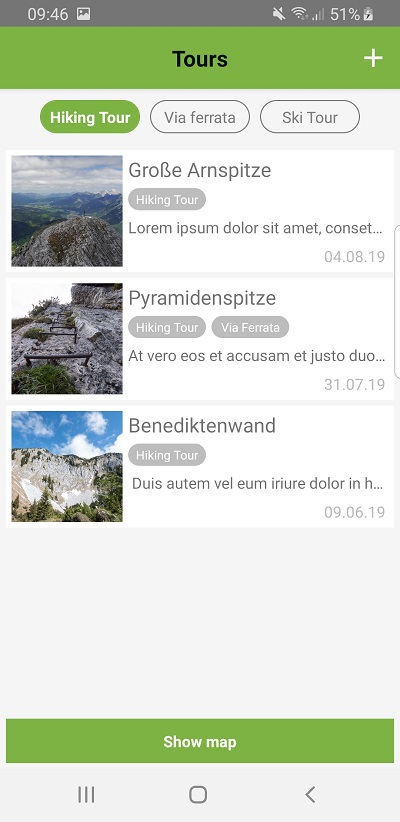
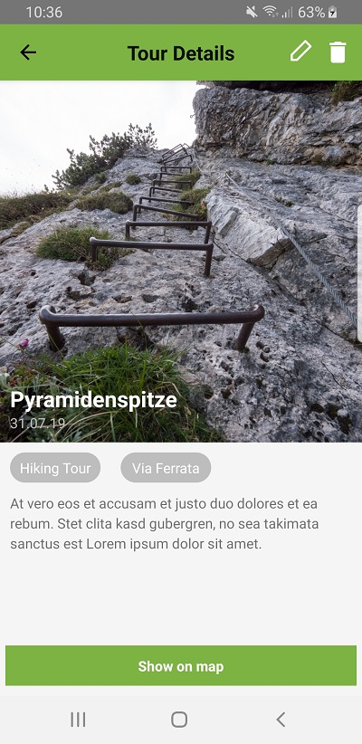
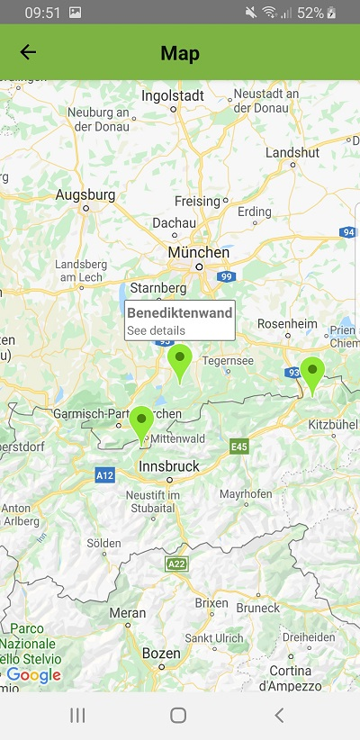
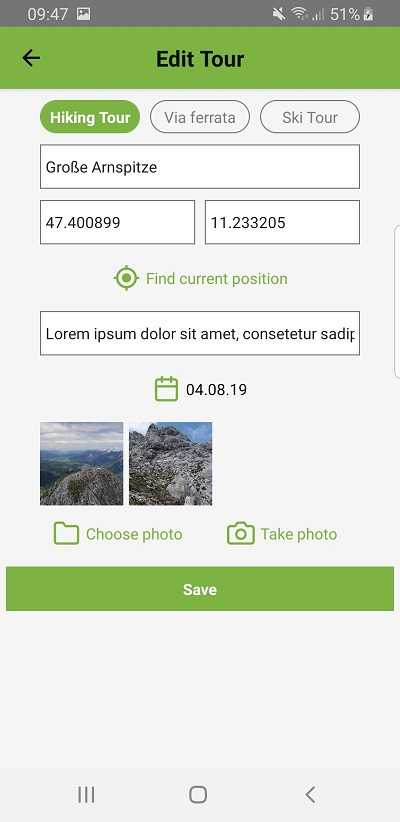

# MountainBook
This project is a mobile app for mountaineers to give them the possibility to keep a record of their hikes and tours in the mountains.

The motivation for this project is to practice mobile app development with React Native.

## Screenshots
   

## Technologies
* JavaScript
* React Native
* Redux

## Functionalities
#### Tour overview
User gets a scrollable list of all added tours.
#### Filtering tours in overview
User has the possibility to filter all tours by type of tour (hiking tour, via ferrata, ski tour).
#### Adding tours
User can add a new tour including information about name, location, description and date. There is also the possibility to 
upload images related to the tour.
#### Editing tours
User can edit existing tours and change previously entered data.
#### Deleting tours
User can delete tours.
#### Show tours on map
User can see location of the tours on a map. Data used to display a tour on the map is geolocation data provided by the 
smartphone or location data the user entered manually.

## Persistance of tour data
Persistance and management of tour data is done via a Redux store.

## Further development ideas
* Implemement a database solution for storing tour data
* Add more possibilities to the sorting functionality
* Use GPS data to calculate covered distance, altitude difference, etc.
